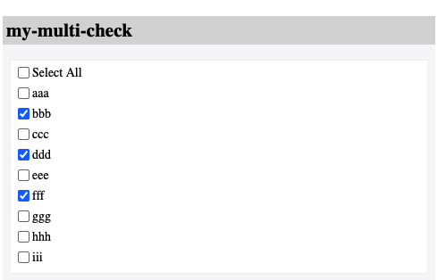

Recruitment DevQA Homework - MultiCheck
=======================================

## Task

Implement a react function component with typescript/javascript.

1. use typescript/javascript + react
1. show your best practise
1. use github pull request to submit your code

Find `TODO` in code to implement, you can also change any code in codebase to make it better.

## Component Requirement:



1. The component has a label
2. The special `Select All` option
   1. if checked, all other options are checked
   2. if unchecked, all other options are unchecked
   3. if all other options are checked, it should be checked
   4. if any other option are unchecked, it should be unchecked

Out of scope:

1. You don't need to provide any css style
2. The "Select All" doesn't need extra states like "partial selected"

## Dev

```
npm install
npm run dev
```

## Test

```
npm test
```

1. Please use html native checkbox (`<input type="checkbox" />`) as the base,
   the style doesn't need to be exactly the same
2. No need to test `App.tsx`, only test MultiCheck and related components and code
